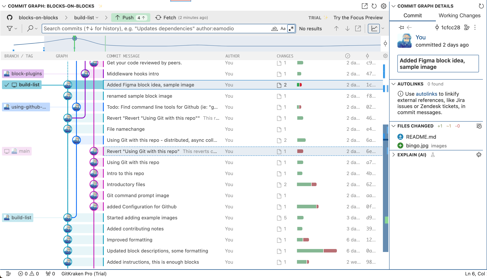
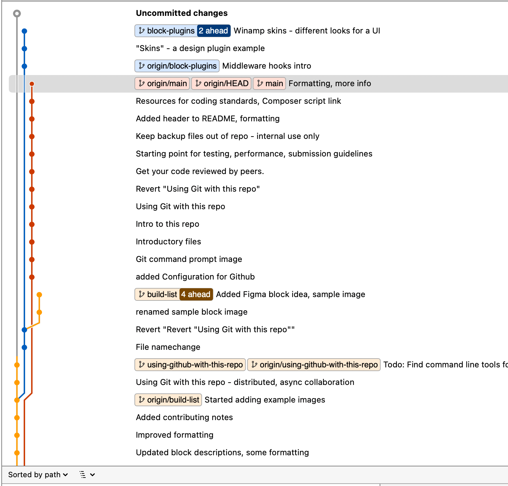
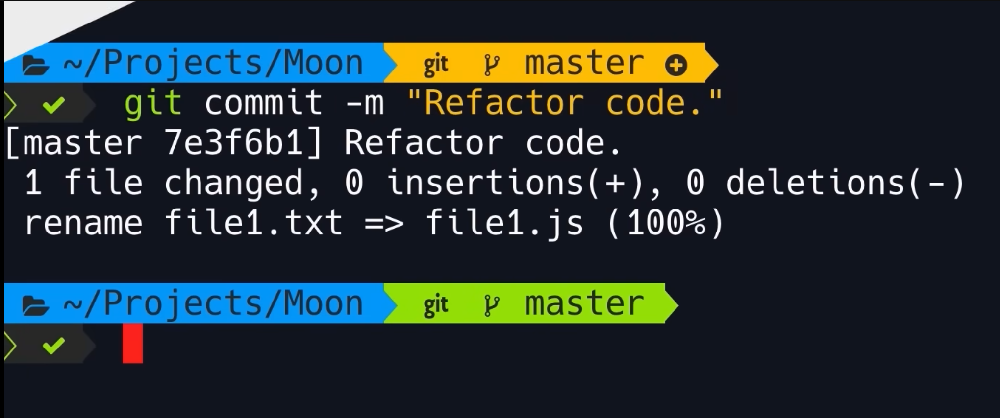

## Boilerplate Github setup - quality of life
- VS Code extensions
- Github repository visualization
- Shell prompt themes for Git
- Code completion
- Automated testing

# Gitlens - Extension for VS Code
[Gitlens](https://marketplace.visualstudio.com/items?itemName=eamodio.gitlens) - shows Github activity in VS Code
This extension helps to better manage your repository and commit history, branches etc inside VS Code.

### Visual commit history with Gitlens

To access this panel, click on Gitlens in the main navigation in VS Code and click Commit Graph

# Sourcetree

So far I've found the user interface to work well with Sourcetree, here's the project as of this commit

[Download Sourcetree](https://www.sourcetreeapp.com/)

When I first grasped Git (re: that "Aha!" moment) - I used Sourcetree on one monitor and VS Code in the other. 
Watching the changes show up in real time, uncommited files, what it looked like when branches changed seem to help me understand how Git worked.
I also used Sourcetree to switch branches to add ideas for new blocks, update documentation, etc. It helped to have both windows open.

Gitlens has a visual interface for VS Code, but it is a paid feature, so that's why I am using 
Also because it is built by Atlassan which is a front-runner in the SDLC SaaS industry.

# Better Git prompts 

On the command-line, improve the look of your prompt when in a Git repository.
If you set this up in your standard terminal (shell), it will transfer to VS Code or another IDE.

# Agnoster theme for Oh My Zsh
https://github.com/ohmyzsh/ohmyzsh/wiki/Themes#agnoster
[Agnoster theme on github](https://github.com/agnoster/agnoster-zsh-theme)
- First install Powerline fonts
---- How to do this???
https://inspirnathan.com/posts/22-install-ohmyzsh-with-agnoster-theme/

- Show active branch
- Is branch dirty?
- How many commits ahead?
- How to install this prompt

# Extras / Notes
- How to create a healthy Github repository - [by Yoast](https://joost.blog/healthy-github-repository/)
- Github Actions for a Healthy Repository - [by Yoast](https://joost.blog/github-actions-wordpress/)
- Github Cheat Sheet [PDF download](./assets/git-cheat-sheat.pdf)
- Intro to Git [video tutorial](https://www.youtube.com/watch?v=8JJ101D3knE) (1 hour)

# Todo
- Add instructions for installing better Git command promps
- Instructions for branch and command completion in Github: CLI
- Sample / demo repo to show how to use Git