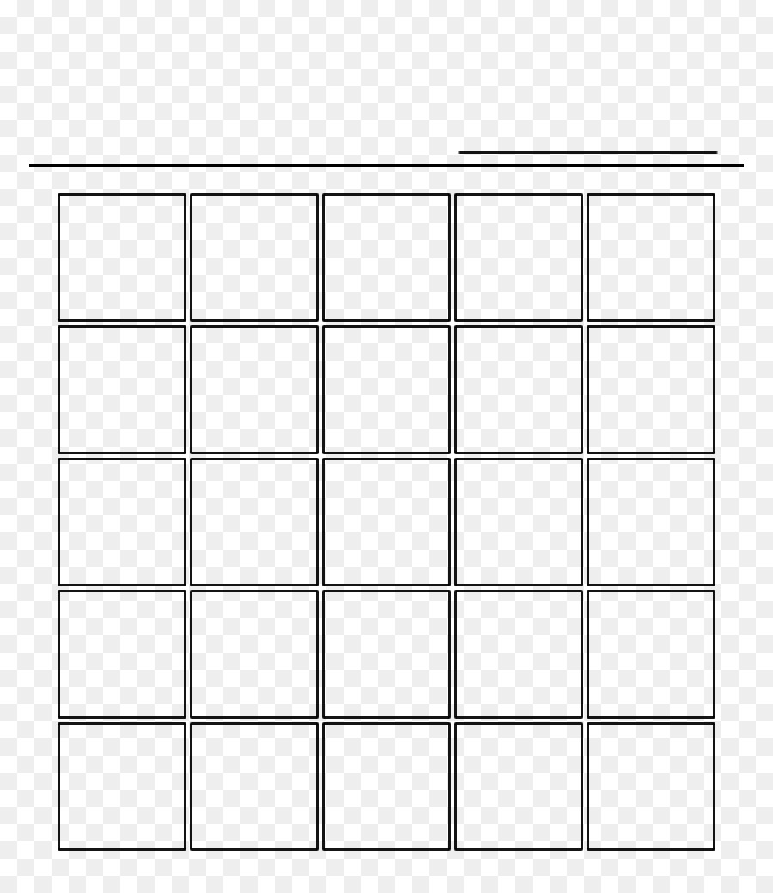

# Blocks on Blocks

<table style="background-color: #000">
<tr>
<th> About this repo </th>
<th> Contributing </th>
</tr>
<tr>
<td style="color: #fff">

<pre>
collaborative
JavaScript
block development
</pre>
</td>
<td style="color:#f1f1f1">

[PLUGINS](./PLUGINS.md)

BLOCKS (TODO)

[Using Git with this repo](./GITHUB.md)

[CONTRIBUTING](./CONTRIBUTING.md)

[CODE REVIEW](./CODEREVIEW.md)

[LICENSE](./LICENSE)

[TESTING](./TESTING.md)

</td>
</tr>
</table>

# Blocks on Blocks
Lots of blocks to develop. Made to demonstrate how to do WordPress development with Git. Some workflow stuff included here and there.

This README file is made to link to the various projects and to provide direction on how to compile and work on the projects. This is meant to be a collaborative effort and expertise into distributed work, using Git, and doing cutting-edge stuff with WordPress.

### Configuration for Github (Collaboration)
*TODO* Build out info pages
- Install Git suggestions
- Helpful VS Code extensions
- GUIs for Git
- Git cheat sheet

## Blocks to Build

  
Amazon Price Check widget or Gutenberg Block

  
  Input field that uses Debounce to wait for a user to stop typing, then uses the most modern API search for Amazon to find a product that most likely matches this product name. Returns a price.

  
Brand board

  
  Series of blocks showcasing a brand identity, with with sample marketing material within a WordPress Dashboard.
- Create a page
- Add Brand board
- Create admin page or link
*TODO*: upload brand-board.png

  
Hero with WordPress Form

  
  Popular amongst signup websites. Great for non-profit organizations, lead generation, the example is for a past political candidate. 
- *TODO*: upload Image of lumberjack

  
Markdown block

  
  Display the info in this block as Markdown. Allow use of RichText editor.
- This I believe exists in Jetpack already...
- Could showcase how to use a library within the context of a block

  
Google Charts block

  
Google Charts block (demo/POC)
https://blog.logrocket.com/use-google-charts-react/

Possible use case: Import a CSV file and it generates a chart based on certain header fields (must label which are headers)
- Upload CSV file
- Parse data into table which shows in both UIs
- Includes Chart generated by Google Charts API
- Showcases a sample data visualization 
- Starting use case: Pie chart

  
Story block

  
  Story Block (from WordPress.com)
https://wordpress.com/support/wordpress-editor/blocks/story-block/
- Creating a similar block using InnerBlocks and the Cover block

Could make it a Snapchat style story, with a custom editable (or pulls from page title) heading. Make the heading draggable and the photo refocus able as a background.. swipe to make it go away or drag from top down to close it. 
- Todo: Upload golf story from Facebook as an example
- Discuss: Is this available in Jetpack?
- Possible use case for Block Variations
- Looks like AMP

  
Quick gig block

  
  Include basic contact info, amount, close date, status. Allow status change to add to CRM (invoice paid)
- Create a custom publishing status for this post, when marked Paid, gig is sent to CRM or Project Management software
- Part of the freelancer toolkit

  
Page intro / paywall

  
  Article Teaser (read more)
{include notes}
When my page has more than 2 paragraphs on it, fade bottom out.
Selector info from Wes Bos's podcast: 21:14 - Quantity Queries for CSS
https://syntax.fm/714?t=0:21:14

  
Account Creation block - multi step

  
  - Add extra fields when a user signs up.
- Possibly using WordPress Core forms.

  
Timer and time logger

  
  Log time. Click to start, stop, record or reset (secondary/small ink only)
- Text field for project description.
- Some way to link it to a project (Freelancer theme)
- Event handling example or Interactivity API?

  
Generate a PDF from this page - block

  
  Generate PDF from this block, or add this block to existing page to allow user to export the entire page as a PDF.

Showcases how to utilize an external library to accomplish a task.

jsPDF library
https://github.com/parallax/jsPDF
- Q: How is this different from a printable stylesheet?
- A: It can handle dynamic data better..??

  
Console log block

  
 Log all activity that comes into the console to this page, in an easy to read format.

- Use details block to collapse messages
- Helpful for debugging without needing to use the console.
- Options to include extra error info (stack trace)

  
Error block

  
  Shows JavaScript errors on the page. Inspired by the convo on Twitch.

Uses the console logger block to function (innerblocks?)

https://www.twitch.tv/videos/2010095349?t=1h14m59s

Sentry.io - record React errors
https://docs.sentry.io/platforms/javascript/guides/react/

  
PageSpeed insights block

  
  - Insert the block and it displays PageSpeed Insights for this page
- Optionally check the PageSpeed Insights for a single block in an iframe

  
Google Lens identify block

  
  WordPress block that allows you to use your camera to take a picture of something and get a result back of what it might be, from Google Lens.
- Utilizes camera on your phone (POC)
- handles file upload and metadata handling (EXIF)
- options

  
Custom Post Type Block

  
 Save a post with custom post types

  
Using Custom Fields with a block

  
- Open Github Issue in Gutenberg: Custom fields 🔗 Blocks [#51373](https://github.com/WordPress/gutenberg/issues/51373) 

  
Music Quote block

  
  - Quote, Band Name, Link to song/video etc
- Song embed
- Affiliate links -  

  
Figma embed block

  
  Show Figma design assets on a web page

## 3.0 Plugin ideas
Visual Slot Fill - Visual Hooks to display Slot Fills
- Uses hooks or HTML Tag processor
- This is a plugin.

## Twitter Sharer
Because Jetpack won't let you share to Twitter...
https://www.icloud.com/notes/08bFoVDbx3KzyjGmUZYjXQESg

## Block Hooks?
for Twitter Sharer - end of post...?
Remove text from "X" (Twitter) share button using Block Hooks

## Multiple Blocks Plugin Boilerplate
A starting point for creating 3 blocks with the standard scripts, and instructions.
- Good first commit
- Multiple Blocks 
https://youtu.be/qbMUU6eNkd4?si=IHCLtXannsJzRmTr&t=1438
- 12 minutes in

## Slotfill Examples
- Bingo card

- NFL picks/pool

### Simple Slot Machine
- Showcases how to use animations
- Showcases slot fill
- Showcases how to use logic (matrices) to figure out if the pull is a winner

## Why to use a static or dynamic block
Better explanation (docs?) for static vs. dynamic blocks.
Examples and use cases.

## Explaining Github block
Show how to get part of WordPress Core, change and create a pull request.
- Word is mispelled in core..?

## Contributing to Core block
Show how to get part of WordPress Core, change and create a pull request.
- Word is mispelled in core..?
- See [CONTRIBUTING](./CONTRIBUTING.md) for notes on starting point
- Show steps, perform plugin and block checks