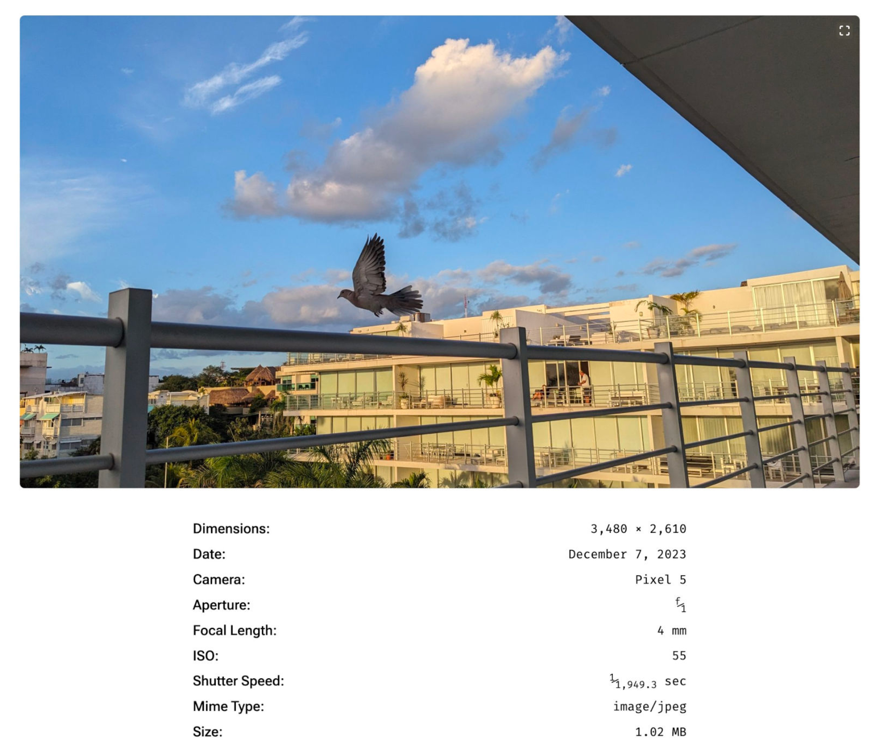

# Extract EXIF (metadata) from an image

On attachment pages, show metadata. Justin Tadlock created a POC of this: 

## Todo: Implement plugin as a sample / contribution piece
Introduction to "Dynamic Attachments" - [extending the default attachment page](https://github.com/wptrainingteam/dynamic-attachments) - WP.org Training Team

[Quick Jump to Developer resource](https://developer.wordpress.org/news/2024/01/22/building-dynamic-block-based-attachment-templates-in-themes/#:~:text=Dynamic%20Attachments%20repository.-,Taking,-it%20to%20the) on extending / modifying templates 
